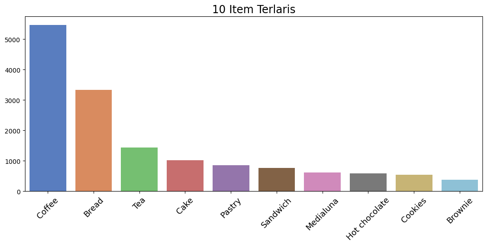
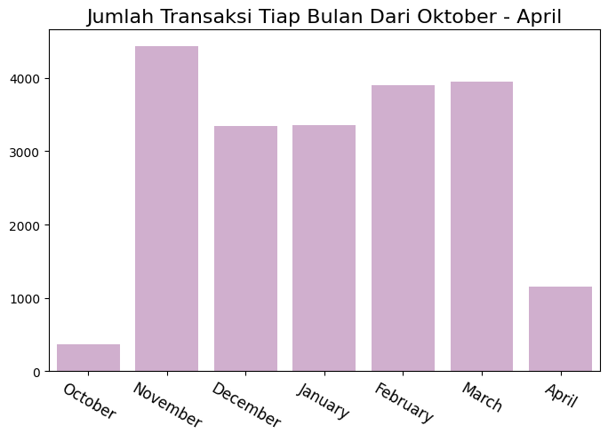
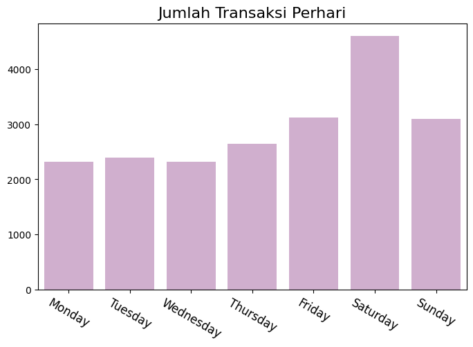
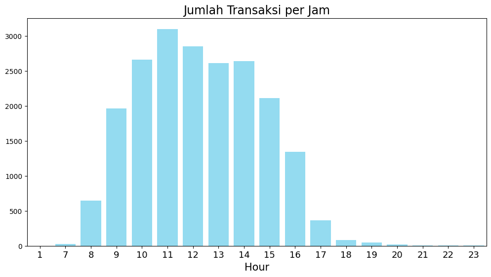
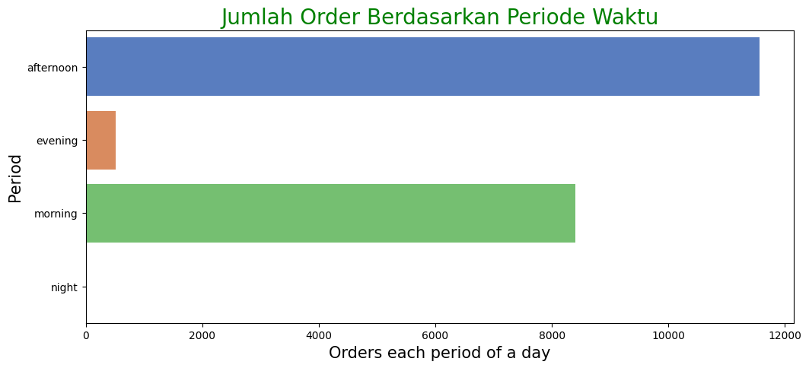
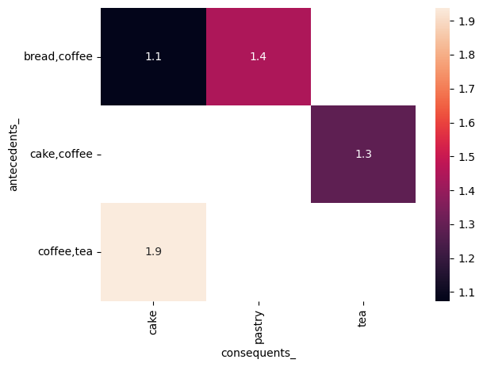

# Laporan Proyek Machine Learning
### Nama : Muhamad Ramadhan Darmawan
### Nim : 211351089
### Kelas : Pagi B

## Domain Proyek
Latar belakang dari aplikasi Market Basket Analysis (MBA) terkait erat dengan kebutuhan perusahaan dan pengecer untuk memahami pola pembelian pelanggan. Analisis keranjang belanja (Market Basket Analysis) adalah suatu teknik data mining yang digunakan untuk mengidentifikasi hubungan antara produk atau barang yang dibeli oleh pelanggan

**Rubrik/Kriteria Tambahan (Opsional)**:
- Tujuan utama dari MBA adalah untuk mengidentifikasi pola pembelian bersama atau asosiasi antara produk, sehingga perusahaan dapat mengambil tindakan yang tepat, seperti strategi pemasaran yang lebih efektif, penataan rak yang lebih baik, dan peningkatan kepuasan pelanggan.
- Prosespenentuan     analisispola     pembelian konsumen  dapat  dilakukan  dengan  menerapkan data  miningdengan   metode  algoritma  apriori. dengan metode tersebut penentuan pola pembelian  dapat  dilakukan  dengan  melihat  hasil dari  kecenderungan  konsumen  membeli  barang berdasarkan   kombinasi   2 itemset.   Pengetahuan baru   yang   dapat   diperoleh   berdasarkan   hasil perhitungan  algoritma  apriori  dan  sistem  yang dibangun  dapat  dilakukan  pengaturan  tata  letak barang   secara   berdekatan   untuk   memudahkan keberadaan barang tersebut
  
  Format Referensi: [Market Basket AnalysisPada Mini Market AyuDengan Algoritma Apriori](https://www.jurnal.iaii.or.id/index.php/RESTI/article/view/280/70) 

## Business Understanding

Pada bagian ini, kamu perlu menjelaskan proses klarifikasi masalah.

Bagian laporan ini mencakup:

### Problem Statements

Menjelaskan pernyataan masalah latar belakang:
- Dengan pertumbuhan variasi produk yang ditawarkan oleh perusahaan dan pengecer, pelanggan sering kali dihadapkan pada pilihan yang besar. Analisis keranjang belanja membantu memahami pola di balik keputusan pembelian kompleks ini.
- Dalam lingkungan bisnis yang semakin kompetitif, perusahaan perlu mengoptimalkan strategi pemasaran dan penjualan mereka. MBA dapat menjadi alat yang efektif untuk mendapatkan keunggulan bersaing dengan memahami preferensi dan kebiasaan pembelian pelanggan.
- Tren dan preferensi pelanggan dapat berubah seiring waktu. Analisis keranjang belanja membantu perusahaan untuk tetap beradaptasi dengan perubahan ini dan menanggapi tren pasar yang baru.

### Goals

Menjelaskan tujuan dari pernyataan masalah:
- Menempatkan produk yang sering dibeli bersama-sama di dekat satu sama lain di toko fisik atau online untuk meningkatkan peluang penjualan.
- Menciptakan penawaran bundel atau paket produk berdasarkan pola pembelian yang ditemukan untuk meningkatkan nilai transaksi pelanggan.
- Mengoptimalkan manajemen persediaan dan rantai pasokan dengan memahami pola pembelian, mengurangi risiko kelebihan stok atau kekurangan stok

## Data Understanding
Dataset ini berisikan mengenai transaksi dari sebuah supermarket yang memiliki 4 kolom yang diperlukan untuk melakukan analisis keranjang belanja.<br> 

Contoh: [The Bread Basket](https://www.kaggle.com/datasets/mittalvasu95/the-bread-basket).

### Variabel-variabel pada Heart Failure Prediction Dataset adalah sebagai berikut:
- Transaction : adalah ID dari setiap transaksi yang bernilai unik (numeric)
- Item : merupakan jenis barang yang dibeli oleh konsumen (object)
- date_time : record waktu saat transaksi terjadi(object/time series)
- period_day : merupakan periode waktu saat transaksi (categorical)
- weekend_weekday : masa waktu saat terjadi transaksi (categorical)

**EDA**:
untuk menampilkan 10 item terlaris menggunakan barplot
```bash
plt.figure(figsize=(13,5))
sns.set_palette("muted")

sns.barplot(x=data['Item'].value_counts()[:10].index,
            y=data['Item'].value_counts()[:10].values)
plt.xlabel("")
plt.ylabel("")
plt.xticks(size = 13, rotation = 45)
plt.title('10 Item Terlaris', size = 17)
plt.show
```
<br>
untuk menampilkan transaksi tiap bulan
```bash
data_perbulan = data.groupby('month')['Transaction'].count()
data_perbulan = pd.concat([data_perbulan.iloc[4:], data_perbulan.iloc[:4]])

plt.figure(figsize=(8,5))
sns.barplot(
    x = ["October", "November", "December", "January", "February", "March", "April"],
    y = data_perbulan.values, color = "#D5AAD3")
plt.xticks(size = 12, rotation = -30)
plt.title("Jumlah Transaksi Tiap Bulan Dari Oktober - April", size = 16)
plt.show()
```
<br>
jumlah transaksi perhari masih menggunakan barplot
```bash
data_perhari = data.groupby('day')['Transaction'].count()

plt.figure(figsize=(8,5))
sns.barplot(
    x = ["Monday", "Tuesday", "Wednesday", "Thursday", "Friday", "Saturday", "Sunday"],
    y = data_perhari.values, color = "#D5AAD3")
plt.xticks(size = 12, rotation = -30)
plt.title("Jumlah Transaksi Perhari", size = 16)
plt.show()
```
<br>
untuk menampilkan transaksi berdasarkan jam
```bash
data_perjam = data.groupby('hour')['Transaction'].count()

plt.figure(figsize=(12,6))
sns.barplot(
    x = data_perjam.index,
    y = data_perjam.values, color = "#85E3FF")
plt.xlabel('Hour', size = 15)
plt.xticks(size = 13)
plt.title("Jumlah Transaksi per Jam", size = 17)
plt.show()
```
<br>
untuk menampilkan transaksi berdasarkan periode waktu
```bash
dayTran = data.groupby('period_day')['Transaction'].count().reset_index()

plt.figure(figsize=(12,5))
sns.barplot(data = dayTran, x = "Transaction", y = "period_day")
plt.ylabel('Period', size = 15)
plt.xlabel('Orders each period of a day', size = 15)
plt.title('Jumlah Order Berdasarkan Periode Waktu', color = 'green', size = 20)
plt.show()
```
<br>

## Data Preparation
sebelumnya kita harus upload file yang sudah kita download ke google colab untuk mengkonfigurasi kaggle
```bash
from google.colab import files
files.upload()
```
setelah di upload konfigurasikan agar kaggle bisa diakses
```bash
!mkdir -p ~/.kaggle
!cp kaggle.json ~/.kaggle/
!chmod 600 /root/.kaggle/kaggle.json
!ls ~/.kaggle
```
kemudian unduh dataset dari kaggle
```bash
!kaggle datasets download -d mittalvasu95/the-bread-basket
```
lalu extract files yang sudah di download dari kaggle
```bash
!mkdir the-bread-basket
!unzip the-bread-basket.zip -d the-bread-basket
!ls the-bread-basket
```
kemudian kita load library yang akan digunakan
```bash
import pandas as pd
import numpy as np
import matplotlib.pyplot as plt
import seaborn as sns
```
kemudian kita upload dataset yang telah di download ke dalam proyek
```bash
data = pd.read_csv('the-bread-basket/bread basket.csv')
```
untuk mengetahui ukuran dataset dan tampilkan dataset
```bash
print("Dataframe Shape : ",data.shape)
data.head()
```
untuk memecah data dari date time agar bisa dikelola
```bash
data['date_time']= pd.to_datetime(data['date_time'], format= "%d-%m-%Y %H:%M")
```
lalu kita tampilkan kembali tipe data dari date time
```bash
data['date_time'].dtype
```
selanjutnya proses date time yang telah diuraikan menjadi kolom baru tanpa merubah isi data date time
```bash
data['month']= data['date_time'].dt.month
data['day']= data['date_time'].dt.weekday
data['hour']= data['date_time'].dt.hour
data.head()
```
untuk memastikan bahwa data dalam kolom 'Item' bersih dari spasi ekstra di awal atau akhir, serta bersifat case-insensitive (huruf kecil atau besar tidak mempengaruhi hasil analisis)
```bash
data['Item'] = data['Item'].str.strip()
data['Item'] = data['Item'].str.lower()
```
## Modeling
kemudian import model dari library yang sudah diinstall
```bash
from mlxtend.frequent_patterns import association_rules, apriori
```
untuk mengetahui item mana saja yang dibeli secara bersamaan dalam transaksi yang sama ditampung di variable baru dan ditampilkan
```bash
item_count = data.groupby(['Transaction', 'Item'])['Item'].count().reset_index(name ='Count')
item_count.head(10)
```
membuat tabel pivot kemudian menampilkan ukuran lalu menampilkan data
```bash
item_count_pivot = item_count.pivot_table(index='Transaction', columns='Item', values='Count', aggfunc = 'sum').fillna(0)
print("Ukuran Dataset :", item_count_pivot.shape)
item_count_pivot.head()
```
merubah tipe data ke int dan menampilkan 
```bash
item_count_pivot = item_count_pivot.astype("int32")
item_count_pivot.head()
```
untuk melakukan proses binarisasi
```bash
def encode(x):
  if x <=0:
    return 0
  elif x >= 1:
    return 1

item_count_pivot = item_count_pivot.applymap(encode)
item_count_pivot.head()
```
menampilkan ukuran data
```bash
print("Ukuran Dataset : ",item_count_pivot.shape )
print("Jumlah Transaksi : ",item_count_pivot.shape[0])
print("Jumlah Items : ",item_count_pivot.shape[1])
```
memasukan nilai support sebagai syarat model
```bash
support = 0.01
frequent_items = apriori (item_count_pivot, min_support = support, use_colnames=True)
frequent_items.sort_values("support", ascending=False).head(10)
```
menampilkan aturan asosiasi berdasarkan metrik lift, dengan hanya mempertimbangkan aturan yang memiliki nilai lift setidaknya 1.
```bash
metric = "lift"
min_threshold = 1

rules = association_rules(frequent_items, metric=metric, min_threshold=min_threshold)[["antecedents","consequents","support","confidence","lift"]]
rules.sort_values('confidence',ascending=False,inplace=True)
rules.head(15)
```
## Evaluation
Pada bagian ini setelah model berjalan kemudian data divisualisasikan dalam bentuk heatmap
```bash
rules['lhs_items'] = rules['antecedents'].apply(lambda x:len(x) )
rules[rules['lhs_items']>1].sort_values('lift', ascending=False).head()
rules['antecedents_'] = rules['antecedents'].apply(lambda a: ','.join(list(a)))
rules['consequents_'] = rules['consequents'].apply(lambda a: ','.join(list(a)))
pivot = rules[rules['lhs_items']>1].pivot(index = 'antecedents_', columns = 'consequents_', values= 'lift')
sns.heatmap(pivot, annot = True)
plt.yticks(rotation=0)
plt.xticks(rotation=90)
plt.show()
```
<br>

## Deployment
pada bagian ini setelah model berhasil dijalankan kemudian aplikasi dibuat di streamlit yang kemudian di luncurkan agar bisa diakses secara publik (siapa saja yang memiliki link)

Link Aplikasi : [Aplikasi Market Basket Analisi Menggunakan Algoritma Apriori](https://proyekuas-qblosugwezurlvxy5syafz.streamlit.app/)
**---Ini adalah bagian akhir laporan---**